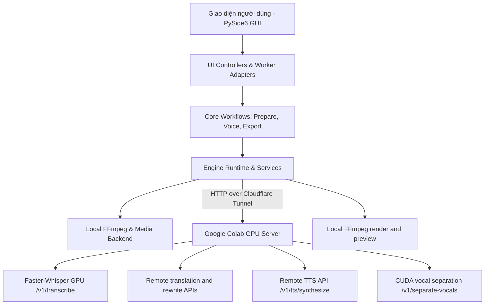

# TÀI LIỆU CẤU TRÚC VÀ KIẾN TRÚC DỰ ÁN CAPCAP (PROJECT STRUCTURE & ARCHITECTURE)

## 1. Giới thiệu tổng quan (Overview)
**CapCap** là ứng dụng tự động dịch thuật và lồng tiếng video đa ngôn ngữ ứng dụng AI hàng đầu. Ứng dụng tích hợp kiến trúc điện toán phân tán thông minh: chạy giao diện và xử lý media nhẹ nhàng trên máy tính người dùng (Client), đồng thời chuyển giao toàn bộ tác vụ AI nặng (Whisper, Demucs, TTS) lên máy chủ **Google Colab GPU (Nvidia T4)** thông qua **Cloudflare Tunnel**.

---

## 2. Kiến trúc tổng thể hệ thống (System Architecture)



### Các tầng kiến trúc (Architectural Layers):
1. **Tầng Giao diện (Presentation Layer - `ui/`)**:
   - Xây dựng bằng **PySide6 (Qt 6)** với giao diện hiện đại phong cách Dark Mode chuyên nghiệp.
   - Quản lý tương tác, bảng điều khiển Timeline, trình xem trước video thời gian thực, bảng cài đặt và các hộp thoại tiến trình.
2. **Tầng Điều khiển & Luồng nền (Controller & Worker Layer - `ui/controllers/`, `ui/worker_adapters/`)**:
   - `PipelineController`: Quản lý toàn bộ vòng đời của quy trình xử lý video, đồng bộ hóa trạng thái tiến trình và các chốt chặn an toàn (pre-flight checks).
   - `PrepareWorkflowWorker`, `VoiceOverWorker`, `FinalExportWorker`: Chạy nền bằng `QThread` đảm bảo giao diện luôn mượt mà 60 FPS, không bị giật lag.
3. **Tầng Luồng công việc (Workflows Layer - `app/workflows/`)**:
   - `PrepareWorkflow`: Trích xuất âm thanh, bóc băng giọng nói (ASR), phân đoạn câu (VAD/Chunking), dịch thuật và tạo phụ đề chuẩn.
   - `VoiceWorkflow`: Khớp giọng đọc AI theo từng mốc thời gian phụ đề, hòa trộn âm thanh gốc và nhạc nền.
   - `ExportWorkflow`: Render và xuất bản video cuối cùng với phụ đề gắn cứng (Hardsub) hoặc phụ đề mềm, video 1080p/4K.
4. **Tầng Dịch vụ & Động cơ (Services & Engines Layer - `app/services/`, `app/engines/`)**:
   - `EngineRuntime`: Quản lý tập trung các Adapter (Whisper, Demucs, FFmpeg, Piper, Translator).
   - `RemoteWhisperAdapter`: Gửi âm thanh dưới dạng Base64 lên máy chủ Colab GPU và nhận lại mốc thời gian phụ đề chính xác từng mili-giây.
   - `RemoteVocalAdapter`: Gửi audio đã trích xuất lên Colab và nhận hai stem `vocals.wav`/`no_vocals.wav`; không cho phép tách giọng bằng CPU trên máy Windows.
5. **Tầng Máy chủ Đám mây (Cloud Colab GPU Layer - `colab/`)**:
   - Sổ tay `CapCap_All_in_One_Colab.ipynb`: Khởi động `remote_api_server.py` với profile nội bộ `local`, GPU CUDA và capability cho Whisper, translate/rewrite, TTS, tách giọng.
   - Sổ tay `CapCap_Whisper_Colab.ipynb`: Server FastAPI tối giản chỉ có capability `transcribe`; phù hợp cho nút bóc băng riêng lẻ, không dùng cho pipeline có TTS/tách giọng.

---

## 3. Cấu trúc thư mục chi tiết (Directory Layout)

```
CAPCAP/
│
├── AGENTS.md                   # Quy tắc bắt buộc của trợ lý AI (Giải thích -> Đề xuất -> Chờ duyệt)
├── GEMINI.md                   # Bản sao quy tắc cho các agent AI khác
├── PROJECT_GOALS.md            # Tài liệu yêu cầu và mục tiêu cốt lõi của dự án
├── ERROR_LOG.md                # Nhật ký theo dõi lỗi, nguyên nhân và cách xử lý
├── PROJECT_STRUCTURE.md        # Tài liệu cấu trúc dự án chuẩn (File hiện tại)
├── WORKFLOW_GUIDE.md           # Workflow vận hành, lựa chọn chạy và hand-off SRT ngoài app
├── CapCap.spec                 # Cấu hình đóng gói PyInstaller
├── build_final_clean.bat       # Script build và đóng gói EXE bản phát hành
│
├── app/                        # TẦNG LÕI ỨNG DỤNG (CORE LOGIC & ENGINES)
│   ├── engines/                # Các adapter động cơ AI & Media
│   │   ├── remote_whisper_adapter.py    # Adapter gọi API bóc băng Colab GPU
│   │   ├── remote_vocal_adapter.py      # Adapter tách giọng qua Colab GPU
│   │   ├── remote_tts_adapter.py        # Adapter gọi API TTS từ xa
│   │   ├── remote_translator_adapter.py # Adapter gọi API dịch thuật từ xa
│   │   ├── ffmpeg_adapter.py            # Adapter xử lý video/audio bằng FFmpeg
│   │   ├── demucs_adapter.py            # Adapter tách giọng nói và nhạc nền
│   │   ├── tts_adapter.py               # Adapter tạo giọng đọc Piper TTS cục bộ
│   │   └── translator_adapter.py        # Adapter dịch thuật trực tiếp
│   │
│   ├── services/               # Các dịch vụ xử lý dữ liệu và thuật toán
│   │   ├── engine_runtime.py            # Quản lý vòng đời và lựa chọn adapter
│   │   ├── project_service.py           # Quản lý lưu trữ/tải project.json
│   │   ├── segment_service.py           # Thuật toán cắt, gộp và đồng bộ phụ đề
│   │   ├── chunking_service.py          # Tách audio theo khoảng lặng (VAD)
│   │   └── voice_catalog_service.py     # Quản lý danh sách giọng đọc tiếng Việt/Anh
│   │
│   ├── workflows/              # Các quy trình công việc khép kín
│   │   ├── prepare_workflow.py          # Quy trình chuẩn bị (Extract, ASR, Translate)
│   │   ├── voice_workflow.py            # Quy trình lồng tiếng (TTS, Sync, Mix)
│   │   └── export_workflow.py           # Quy trình xuất video thành phẩm
│   │
│   ├── remote_api.py           # Client HTTP kết nối Cloudflare Tunnel Colab
│   ├── runtime_paths.py        # Quản lý đường dẫn môi trường (Dev vs Frozen EXE)
│   └── runtime_profile.py      # Quản lý cấu hình chạy (Khóa cứng 'remote' Colab)
│
├── ui/                         # TẦNG GIAO DIỆN NGƯỜI DÙNG (PYSIDE6 QT GUI)
│   ├── main_window.py          # Cửa sổ chính và logic điều phối giao diện
│   ├── gui.py                  # Điểm khởi chạy giao diện
│   ├── controllers/            # Các bộ điều khiển tách biệt theo tính năng
│   │   ├── pipeline_controller.py       # Điều khiển nút Generate, Run All, Colab check
│   │   ├── preview_controller.py        # Điều khiển phát video, seek, audio volume
│   │   └── subtitle_controller.py       # Điều khiển chỉnh sửa trực tiếp phụ đề
│   │
│   ├── views/                  # Các thành phần giao diện chuyên biệt
│   │   ├── start_panel.py               # Màn hình chào mừng và tạo dự án mới
│   │   ├── advanced_tabs.py             # Bảng cài đặt nâng cao & tinh chỉnh
│   │   ├── preview_panel.py             # Khung phát video và waveform
│   │   └── editor/                      # Trình chỉnh sửa Timeline và Track
│   │       ├── timeline.py              # Timeline đa rãnh (Video, Sub, Voice, BG)
│   │       └── track_labels.py          # Nhãn tên rãnh âm thanh/phụ đề
│   │
│   ├── worker_adapters/        # Các QThread chạy ngầm cho giao diện
│   │   └── processing_workers.py        # PrepareWorkflowWorker, VoiceOverWorker
│   │
│   └── utils/                  # Tiện ích giao diện & cài đặt
│       ├── settings_utils.py            # Đọc/ghi cấu hình người dùng
│       └── media_backend.py             # Kết nối backend trình phát media
│
├── colab/                      # TẦNG MÁY CHỦ COLAB GPU
│   ├── CapCap_All_in_One_Colab.ipynb    # Notebook đầy đủ (Whisper/TTS/tách giọng)
│   └── CapCap_Whisper_Colab.ipynb       # Notebook bóc băng tối giản
│
├── bin/                        # Chứa các file thực thi nhị phân phụ trợ (ffmpeg, ffprobe)
├── release/                    # Bàn giao duy nhất một file CapCap.exe (PyInstaller one-file)
└── projects/                   # Thư mục lưu trữ các dự án làm việc của người dùng
```

---

### 3.1. Canonical Colab Notebook

- Giao diện desktop chỉ mở và hướng dẫn chạy `CapCap_All_in_One_Colab.ipynb`.
- Notebook này là server GPU duy nhất cho pipeline: `transcribe`, `translate`, `tts` và `separate_vocals`.
- `CapCap_Whisper_Colab.ipynb` chỉ còn là tài liệu kỹ thuật legacy; không thuộc luồng Setup Colab của người dùng.

### 3.2. Nguồn phụ đề kép STT + OCR (External SRT Workflow)

- Trong **Settings → Subtitle source**, lựa chọn `Audio STT + Video OCR (two separate SRT files)` tạo hai nguồn độc lập, không ghép tự động:
  - `projects/<project-id>/subtitle/original_stt.srt`: lời nói được bóc băng bằng Whisper qua All-in-One Colab GPU.
  - `projects/<project-id>/subtitle/original_ocr.srt`: chữ phụ đề quét độc lập từ khung hình video bằng OCR.
- `PrepareWorkflow` luôn lưu SRT STT trước khi chạy OCR; nếu OCR không đọc được vùng chữ, file STT vẫn còn nguyên.
- Mode này dừng pipeline sau khi tạo hai nguồn và bỏ qua dịch/TTS. Người dùng ghép, hiệu chỉnh và dịch bằng Antigravity IDE, sau đó dùng **Import Translated SRT** để nạp bản SRT hoàn chỉnh rồi mới chạy **Generate Voice / TTS**.
- Các artifact `subtitle_original_stt_srt` và `subtitle_original_ocr_srt` được lưu trong `project.json` và hiển thị trong **Processed Files**.

## 4. Luồng xử lý dữ liệu chi tiết (Detailed Pipeline Flow)

### Bước 1: Khởi tạo & Kiểm tra kết nối Colab
1. Người dùng chọn video đầu vào (`.mp4`, `.mkv`, `.avi`...).
2. Khi bấm **Generate / Run All**:
   - `PipelineController.run_all_pipeline` kiểm tra xem người dùng đã nhập link Colab chưa.
   - Nếu chưa có hoặc link offline, hệ thống lập tức mở hộp thoại Cài đặt Colab để người dùng dán link và token mới.

### Bước 2: Chuẩn bị & Bóc băng (Prepare & ASR)
1. `PrepareWorkflowWorker` chạy ngầm:
   - Dùng `FFmpegAdapter` trích xuất âm thanh từ video sang định dạng WAV 16kHz Mono (mất < 1 giây).
   - Với chế độ Clean, gửi audio tới `POST /v1/separate-vocals` để tách stem trên GPU Colab; không chạy ONNX trên máy Windows.
   - Mã hóa audio/chunk thành Base64 và gửi request `POST /v1/transcribe` lên **Google Colab GPU Server**.
   - Server Colab chạy mô hình Faster-Whisper trên card GPU Nvidia T4 và trả về danh sách các phân đoạn hội thoại cùng timestamps chính xác.
2. Dịch thuật phụ đề:
   - Sử dụng các nhà cung cấp dịch thuật AI (Gemini AI Polisher hoặc Google Web Translate) để dịch các đoạn thoại sang ngôn ngữ đích.
   - Tối ưu hóa độ dài câu và lưu trạng thái vào `project.json`.
3. Với mode **STT + OCR**:
   - Pipeline lưu riêng `original_stt.srt` và `original_ocr.srt`, sau đó dừng để bàn giao cho trình biên tập SRT ngoài.
   - Không gọi dịch tự động, không gọi TTS và không tự ghép hai nguồn.

### Bước 3: Lồng tiếng AI (AI Dubbing & Audio Mixing)
1. `VoiceOverWorker` chạy ngầm:
   - Duyệt qua từng câu phụ đề đã dịch.
   - Gọi `POST /v1/tts/synthesize` tới Colab để tạo giọng đọc AI khớp với độ dài câu và ngữ cảnh.
   - Hòa trộn rãnh giọng lồng tiếng mới với rãnh nhạc nền đã được tách từ trước (Duck Audio: tự động giảm âm lượng nhạc nền khi có tiếng nói).

### Bước 4: Xem trước & Xuất video (Preview & Export)
1. Người dùng có thể nghe và chỉnh sửa trực tiếp từng câu phụ đề trên Timeline.
2. Khi bấm **Export Video**:
   - `FinalExportWorker` chạy FFmpeg để ghép rãnh âm thanh hoàn chỉnh, phụ đề và render video đầu ra với chất lượng gốc.
