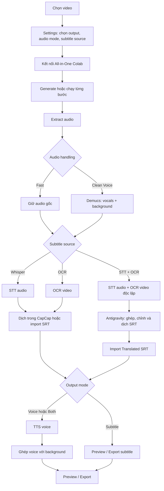
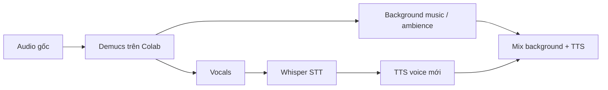
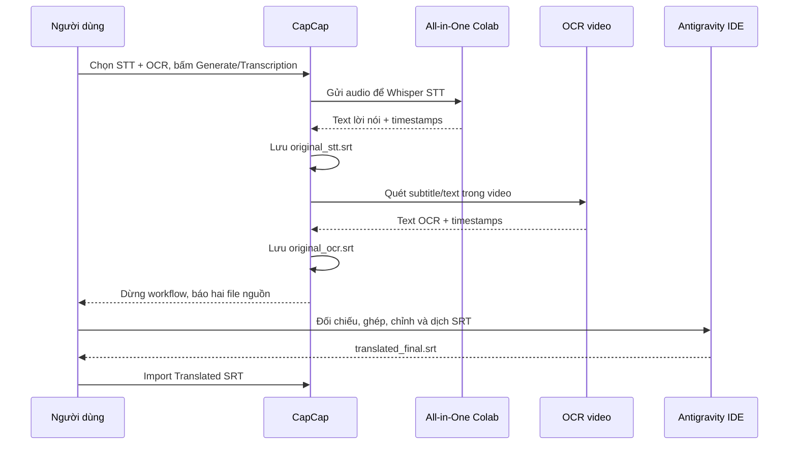
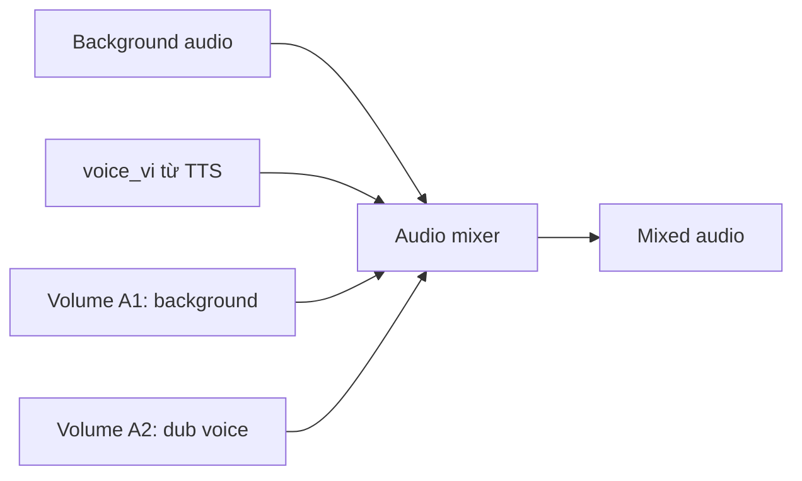

# CapCap — Workflow chi tiết từ video đến thành phẩm

## 1. Sơ đồ tổng quát



## 2. Bước 1 — Chọn video và tạo project

1. Mở CapCap, chọn file video.
2. App tạo một project riêng cho video đó trong:

```text
projects/<project-id>/
```

3. Toàn bộ audio, SRT, stem tách âm thanh, metadata Timeline và trạng thái workflow của video nằm trong project này. Vì vậy mỗi video không dùng lẫn dữ liệu của video khác.

## 3. Bước 2 — Cài đặt trước khi chạy

Mở **Settings** và chọn các option bên dưới.

### 3.1. Output mode

| Option | App sẽ làm gì |
|---|---|
| `Subtitle` | Tạo/nhập phụ đề đã dịch để preview và export video có subtitle. Không tạo voice. |
| `Voice` | Cần SRT đã dịch, tạo voice AI và export với audio lồng tiếng. |
| `Both` | Giữ subtitle đã dịch và tạo voice AI để export video có cả subtitle lẫn lồng tiếng. |

### 3.2. Audio handling

| Option | Dùng khi nào | STT dùng audio nào | Audio nền khi lồng tiếng |
|---|---|---|---|
| `Fast` | Video có audio tương đối rõ, cần tốc độ | `extracted_audio.wav` | Audio gốc đã extract |
| `Clean Voice` | Có nhạc nền/tiếng ồn, cần STT sạch hơn | Stem `vocals` | Stem `music` hoặc `no_vocals` |

Luồng `Clean Voice`:



`Fast` không tách stem: STT chạy trực tiếp từ audio đã extract và audio đó được dùng làm background ở bước mix.

### 3.3. Subtitle source

| Option trong Settings | Dữ liệu dùng để tạo subtitle | Kết quả phù hợp |
|---|---|---|
| `Audio (Whisper) - Quality` | Lời nói trong audio | Video có dialogue/voice-over. Đây là lựa chọn chuẩn khi chạy qua Colab. |
| `Audio (SenseVoice) - Speed` | Lời nói trong audio | Lựa chọn tốc độ/tương thích. Khi dùng phiên Colab của desktop, app dùng STT remote để không chạy AI nặng trên máy. |
| `Video (OCR)` | Chữ subtitle/text đã hiển thị trên frame video | Video đã có hard-sub hoặc caption trên hình. |
| `Audio STT + Video OCR (two separate SRT files)` | Đồng thời lời nói và chữ trên video | Khi cần tự đối chiếu, ghép và dịch bằng Antigravity IDE. |

### 3.4. Option riêng cho OCR

| Option | Ý nghĩa | Khi chọn |
|---|---|---|
| `Subtitle position: Bottom` | OCR chỉ quét phần dưới khung hình | Subtitle thường ở đáy video. |
| `Subtitle position: Top` | OCR chỉ quét phần trên | Subtitle/caption nằm ở đầu video. |
| `Subtitle position: Full frame` | OCR quét toàn bộ frame | Không rõ vị trí chữ hoặc có text ở nhiều nơi. |
| `OCR sampling rate` | Số frame OCR quét mỗi giây | Tăng khi subtitle xuất hiện rất nhanh; để Auto hoặc thấp khi ưu tiên tốc độ. |

### 3.5. Option ngôn ngữ và dịch

| Option | Ý nghĩa |
|---|---|
| `Source language` | Ngôn ngữ lời nói/chữ gốc; chọn `Auto` nếu chưa rõ. |
| `Target language` | Ngôn ngữ của SRT dịch và voice mới. |
| `Translator provider` | Dịch bằng Google Translate, Google AI Studio, OpenAI hoặc Ollama tùy cấu hình. |
| `AI polish / style instruction` | Chuốt câu hoặc áp phong cách dịch sau khi có bản dịch thô. |
| `Skip translation` | Chỉ tạo SRT nguồn, không dịch trong lượt này. Dùng khi muốn tự dịch bên ngoài. |

## 4. Bước 3 — Kết nối Colab

1. Trong Settings, bấm **All-in-One Colab**.
2. Mở đúng notebook `CapCap_All_in_One_Colab.ipynb` và chạy toàn bộ cell.
3. Notebook cung cấp một URL tunnel và token cho phiên hiện tại.
4. Dán URL/token vào Settings của CapCap, bấm **Test Connection**, rồi Save.

Notebook All-in-One là nơi chạy các bước AI nặng:

```text
Whisper STT       -> transcribe
Demucs            -> separate_vocals
TTS               -> tts
Translate/rewrite -> translate/rewrite
```

Không cần mở notebook Whisper-only thứ hai.

## 5. Bước 4 — Tạo nguồn subtitle

Bạn có thể bấm **Generate** để app đi theo full workflow, hoặc chạy từng bước bằng **Transcription**.

### 5.1. Whisper STT

```text
Video
  -> extract audio
  -> [Clean Voice: tách vocals/background]
  -> gửi audio/vocals tới Colab
  -> Whisper trả về text + timestamps
  -> tạo SRT gốc
```

File gốc chuẩn:

```text
projects/<project-id>/subtitle/original.srt
```

### 5.2. OCR

```text
Video
  -> lấy frame theo OCR sampling rate
  -> chỉ giữ vùng Bottom / Top / Full frame đã chọn
  -> OCR đọc chữ và gộp các frame có text giống nhau
  -> tạo SRT gốc
```

File gốc chuẩn:

```text
projects/<project-id>/subtitle/original.srt
```

OCR không dùng lời nói. Nếu không có kết quả, đổi vùng OCR hoặc tăng sampling rate rồi chạy lại.

### 5.3. STT + OCR độc lập

Mode này không chọn một nguồn thay nguồn kia; nó tạo hai nguồn tách biệt.



Hai file đầu ra:

```text
projects/<project-id>/subtitle/original_stt.srt
projects/<project-id>/subtitle/original_ocr.srt
```

Hành vi của mode này:

- `original_stt.srt`: lời nói do STT tạo.
- `original_ocr.srt`: chữ có trên hình do OCR tạo.
- CapCap không ghép hai file.
- CapCap không tự dịch hai file.
- CapCap không tạo TTS ngay trong lượt chạy này, kể cả đang chọn output Voice/Both.
- Pipeline dừng sau khi hai nguồn sẵn sàng.
- Nếu OCR thất bại, `original_stt.srt` vẫn được giữ để bạn có thể tiếp tục dùng nó.

## 6. Bước 5 — Tạo SRT đã dịch

Sau khi có subtitle nguồn, chọn một trong hai cách.

### Cách A — Dịch trong CapCap

```text
original.srt
  -> Translate
  -> dịch thô
  -> [tuỳ chọn] AI Polish / Rewrite
  -> subtitle.srt
```

File phụ đề dịch mặc định:

```text
projects/<project-id>/subtitle/subtitle.srt
```

Bạn có thể sửa text, tách/gộp cue và chỉnh timestamp trực tiếp trên Timeline trước khi tạo voice hoặc export.

### Cách B — Dịch ngoài app bằng Antigravity IDE

Đây là cách cần dùng cho mode STT + OCR hoặc bất kỳ khi nào bạn muốn tự kiểm soát bản dịch.

1. Mở SRT nguồn trong Antigravity IDE.
2. Đối chiếu STT và OCR nếu có hai file.
3. Ghép hoặc bỏ các cue không cần thiết.
4. Dịch sang ngôn ngữ đích.
5. Giữ định dạng SRT hợp lệ:

```srt
1
00:00:01,000 --> 00:00:03,000
Nội dung đã dịch
```

6. Lưu file, ví dụ `translated_final.srt`.
7. Trong CapCap bấm **Import Translated SRT** và chọn file này.

Sau khi import, file đó trở thành `Translated SRT` đang được app dùng cho Timeline, TTS và export.

## 7. Bước 6 — Tạo voice (TTS)

Bước này chỉ cần cho output `Voice` hoặc `Both`.

Điều kiện để bấm **Generate Voice / TTS**:

1. Có Translated SRT hợp lệ, do CapCap dịch hoặc Import Translated SRT.
2. Colab đang kết nối và có capability `tts`.
3. Đã chọn voice và tốc độ đọc.

Luồng TTS:

```text
Translated SRT
  -> chia theo cue/timestamp
  -> gửi từng đoạn sang TTS Colab
  -> tạo các đoạn voice
  -> căn thời lượng theo cue (speed/timing sync)
  -> ghép thành track voice_vi
```

Các option ảnh hưởng bước TTS:

| Option | Tác dụng |
|---|---|
| `Voice` | Chọn giọng đọc dùng cho ngôn ngữ đích. |
| `Voice speed` | Tăng/giảm tốc độ đọc; dùng để khớp thời lượng cue. |
| `Timing sync` | Điều chỉnh cách khớp voice với mốc thời gian subtitle. |
| Speaker/voice assignment | Nếu project có speaker metadata, có thể gán giọng theo speaker. |

Track kết quả được lưu dưới artifact `voice_vi` của project.

## 8. Bước 7 — Mix background và voice

Sau khi TTS hoàn tất, CapCap tạo mix khi preview/export:



Nguồn background được chọn tự động theo Audio handling:

| Audio handling | Background dùng để mix |
|---|---|
| `Fast` | Audio gốc đã extract |
| `Clean Voice` | Stem nhạc nền/âm thanh môi trường từ Demucs |

Trong Timeline/Preview:

- `A1 Original`: background/original audio.
- `A2 Dub`: voice TTS.
- Chỉnh volume A1/A2 để cân bằng nhạc nền và lời lồng tiếng.

## 9. Bước 8 — Preview và Export

### Preview

Trước export, kiểm tra:

1. Text/subtitle hiển thị đúng vị trí, font và style.
2. Timestamp cue đúng với hình và voice.
3. Voice nghe rõ hơn background; chỉnh A1/A2 nếu cần.
4. Với output Both, kiểm tra cả subtitle và voice.

### Export Video

| Output mode | Thành phẩm export |
|---|---|
| `Subtitle` | Video có subtitle theo SRT đã dịch/style hiện tại. |
| `Voice` | Video với audio lồng tiếng/mix theo audio track đã chọn. |
| `Both` | Video có subtitle và audio lồng tiếng đã mix background. |

CapCap dùng FFmpeg trên máy để render/export. File video nguồn không bị sửa; thành phẩm là file mới trong thư mục output bạn đã chọn.

## 10. Ba workflow nên dùng

### A. Dịch subtitle nhanh bằng STT

```text
Whisper
-> Generate
-> Translate trong CapCap
-> chỉnh Timeline
-> Export Subtitle
```

### B. Lồng tiếng video thông thường

```text
Whisper + Fast/Clean Voice
-> Translate hoặc Import Translated SRT
-> Generate Voice / TTS
-> chỉnh A1/A2
-> Export Both
```

### C. Kiểm soát subtitle bằng Antigravity IDE

```text
STT + OCR
-> original_stt.srt + original_ocr.srt
-> Antigravity: đối chiếu/ghép/dịch
-> Import Translated SRT
-> Generate Voice / TTS
-> Preview / Export Both
```
